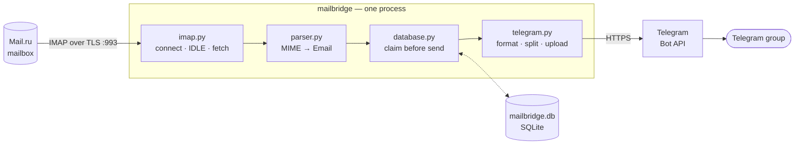

# mailbridge

[](https://github.com/PeacexF/tgmailbot/actions/workflows/ci.yml)

Forwards incoming Mail.ru email to a Telegram group. One process, one mailbox,
one group, one SQLite file — no web UI, no broker, nothing listening on a port.

```text
📩 New email

From: John Doe <john@example.com>
To: user@mail.ru
Subject: Invoice #4821
Date: 2026-09-05 12:41

Hey,

Here's the invoice you requested.

📎 invoice.pdf (284.1 KB)
```

Attachments follow the message as Telegram uploads.

## What it does

- Watches one IMAP folder over TLS, using **IDLE** rather than polling.
- Parses MIME properly: RFC 2047 headers, Cyrillic subjects, unknown charsets,
  HTML-only bodies stripped to readable text.
- Splits long emails across Telegram's 4096-character limit on line boundaries.
- Forwards attachments, skipping oversized ones with a note rather than failing
  the email.
- **Never delivers the same email twice** under normal operation, and never
  loses one: state is committed before the send, so a crash costs a duplicate
  rather than a missing message.
- Catches up on everything that arrived while it was down.
- Recovers from IMAP drops, `UIDVALIDITY` resets, Telegram `429`s and `5xx`s on
  its own, with backoff.
- Keeps bodies, attachments, passwords and tokens out of the logs.

## Architecture



[docs/architecture.md](docs/architecture.md) covers the module boundaries, the
delivery guarantee and the known bounds.

## Quickstart

Requires Python 3.14+ and [uv](https://docs.astral.sh/uv/).

```sh
git clone https://github.com/PeacexF/tgmailbot && cd tgmailbot
uv sync

cp .env.example .env && chmod 600 .env
$EDITOR .env            # mailbox + bot credentials

uv run mailbridge --check     # validate config, no network
uv run mailbridge --dry-run   # fetch from the mailbox, send nothing
uv run mailbridge             # run until stopped
```

You need a Mail.ru **application password** — the account password is rejected
outright for IMAP — plus a bot token from
[@BotFather](https://t.me/BotFather) and the group's chat id.
[docs/configuration.md](docs/configuration.md) walks through all three.

With Docker instead:

```sh
cp .env.example .env && chmod 600 .env && $EDITOR .env
docker compose up -d
```

## Configuration

| Variable | Required | Default |
|---|---|---|
| `MAIL_USERNAME` | **yes** | — |
| `MAIL_PASSWORD` | **yes** | — (Mail.ru app password) |
| `TELEGRAM_BOT_TOKEN` | **yes** | — |
| `TELEGRAM_CHAT_ID` | **yes** | — |
| `MAIL_HOST` | no | `imap.mail.ru` |
| `MAIL_PORT` | no | `993` |
| `MAIL_FOLDER` | no | `INBOX` |
| `DATABASE_PATH` | no | `./data/mailbridge.db` |
| `LOG_LEVEL` | no | `INFO` |

Full descriptions, `.env` precedence rules and CLI flags:
[docs/configuration.md](docs/configuration.md).

## Deployment

Docker Compose, systemd and foreground, plus credential-file permissions and
SQLite backup: [docs/deployment.md](docs/deployment.md).

## Development

```sh
make check      # lint + typecheck + tests, what CI runs
make test
make format
```

## Documentation

| | |
|---|---|
| [Configuration](docs/configuration.md) | Every variable, credential setup, CLI flags |
| [Architecture](docs/architecture.md) | Modules, data flow, the delivery guarantee |
| [Deployment](docs/deployment.md) | Docker, systemd, permissions, backups |
| [Security](SECURITY.md) | Posture and how to report a vulnerability |
| [Contributing](CONTRIBUTING.md) | |

## Scope

One mailbox, one folder, one destination. Multiple accounts, extra folders,
sender/subject filters, Telegram topics and a `/status` command are all
deliberately out of scope.

## License

MIT — see [LICENSE](LICENSE).
